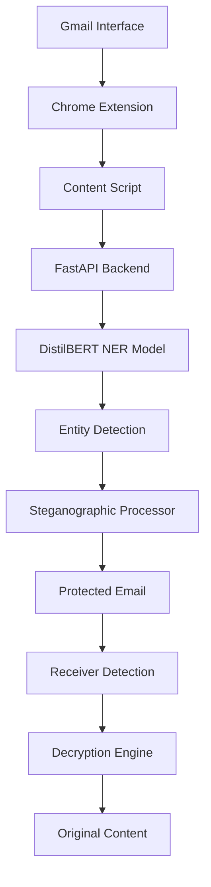

# 🔒 Email Privacy Guardian - Chrome Extension

<div align="center">
  
  
  
  
</div>

A sophisticated Chrome extension that protects sensitive Indian personal information in emails using AI-powered detection and advanced steganographic encryption. The system uses a custom-trained DistilBERT NER model to identify sensitive data and converts it into human-readable text using word-pattern steganography.

## 🌟 Key Features

### 🔍 **Intelligent Detection**
- **AI-Powered NER**: Custom-trained DistilBERT model specifically for Indian sensitive information
- **Multi-Entity Support**: Detects Aadhaar numbers, PAN cards, phone numbers, email addresses, UPI IDs, IFSC codes, and bank account details
- **High Accuracy**: Optimized for Indian data patterns with confidence scoring

### 🛡️ **Advanced Protection Methods**
- **🔐 Steganographic Encryption**: Converts sensitive data into natural-looking text using Base64 encoding and word mapping
- **🎭 Smart Masking**: Replaces sensitive information with masked patterns
- **🔖 Tokenization**: Converts data into secure tokens for safe transmission

### 🔄 **Seamless Integration**
- **Bidirectional Protection**: Works for both senders (encryption) and receivers (decryption)
- **Gmail Integration**: Native support for Gmail compose and read interfaces
- **Real-time Processing**: Instant analysis and protection of email content
- **Invisible Markers**: Uses sophisticated start/end markers for automatic detection

## 🏗️ Architecture



## 🚀 Tech Stack

### **Frontend (Chrome Extension)**
- **JavaScript (ES6+)**: Core extension logic and DOM manipulation
- **HTML5/CSS3**: Extension popup interface and styling
- **Chrome Extension APIs**: Content scripts, background workers, and messaging
- **Manifest V3**: Latest Chrome extension standards

### **Backend (AI Service)**
- **FastAPI**: High-performance async API framework
- **Python 3.8+**: Core backend language
- **Uvicorn**: ASGI server for production deployment

### **AI/ML Components**
- **🤗 Transformers**: Hugging Face transformers library
- **DistilBERT**: Custom fine-tuned model for Indian NER
- **PyTorch**: Deep learning framework
- **NumPy**: Numerical computations

### **Steganography Engine**
- **Base64 Encoding**: Core encoding mechanism
- **Custom Word Mapping**: 64-character to English word conversion
- **Pattern Recognition**: Smart marker detection system

## 📁 Project Structure

```
Chrome_Extension/
├── 📂 extension/              # Chrome Extension Frontend
│   ├── 📄 manifest.json       # Extension configuration
│   ├── 📄 popup.html          # Extension popup UI
│   ├── 📄 popup.js            # Popup logic and controls
│   ├── 📄 content.js          # Gmail integration & steganography
│   └── 📄 background.js       # API communication service worker
│
├── 📂 model/                  # AI Model Files (Download Required)
│   ├── 📄 config.json         # Model configuration
│   ├── 📄 model.safetensors   # Trained model weights
│   ├── 📄 tokenizer.json      # Tokenizer configuration
│   └── 📄 ...                 # Additional model files
│
├── 📄 main.py                 # FastAPI backend server
├── 📄 ner_model.py           # NER model utilities
├── 📄 requirements.txt       # Python dependencies
├── 📄 payload.json          # API testing payload
└── 📄 README.md             # Project documentation
```

## 🛠️ Installation & Setup

### Prerequisites
- **Python 3.8+** installed on your system
- **Google Chrome** browser
- **Internet connection** for model download

### Step 1: Clone Repository
```bash
git clone https://github.com/yourusername/Chrome_Extension.git
cd Chrome_Extension
```

### Step 2: Backend Setup
```bash
# Install Python dependencies
pip install -r requirements.txt

# Download AI model (Required - 500MB+)
# Visit: https://drive.google.com/drive/folders/11Bw1cWwwzY2YoZphTLOh_O7Z-kVOfs53?usp=sharing
# Download all files and place them in ./model/ directory

# Verify model structure:
ls model/
# Should contain: config.json, model.safetensors, tokenizer.json, etc.
```

### Step 3: Start Backend Server
```bash
uvicorn main:app --reload --host 0.0.0.0 --port 8000
```
✅ Server will be running at `http://127.0.0.1:8000`

### Step 4: Install Chrome Extension
1. Open Chrome and navigate to `chrome://extensions/`
2. Enable **"Developer mode"** (toggle in top-right)
3. Click **"Load unpacked"**
4. Select the `extension/` folder from the project directory
5. 📌 **Note your Extension ID** for CORS configuration

### Step 5: Configure CORS (Important!)
Update `main.py` with your actual extension ID:
```python
app.add_middleware(
    CORSMiddleware,
    allow_origins=["chrome-extension://YOUR_EXTENSION_ID_HERE"],
    # Replace YOUR_EXTENSION_ID_HERE with actual ID from Step 4
)
```

## 💻 Usage Guide

### For Senders (Protecting Sensitive Data)

1. **Compose Email**: Open Gmail and start composing an email
2. **Add Sensitive Content**: Include Indian personal information (PAN, Aadhaar, etc.)
3. **Activate Extension**: Click the extension icon in Chrome toolbar
4. **Analyze Content**: Click "Analyze" to detect sensitive information
5. **Choose Protection**:
   - 🔐 **Encrypt**: Converts to natural-looking text using steganography
   - 🎭 **Mask**: Replaces with asterisks and labels
   - 🔖 **Tokenize**: Converts to secure tokens
6. **Apply Protection**: Click "Apply" to transform the email content
7. **Send Safely**: Your email now contains protected information

### For Receivers (Accessing Protected Data)

1. **Open Protected Email**: View an email containing protected content
2. **Automatic Detection**: Extension automatically detects protection markers
3. **Reveal Content**: Click "View Protected Content" in the extension popup
4. **View Original Data**: Protected information is decoded and displayed securely

### Example Transformation

**Original Text:**
```
Please transfer money to account 123456789012, 
IFSC: SBIN0000456, PAN: ABCDE1234F
```

**After Steganographic Encryption:**
```
Regarding important information about better consider day 
early first good have just know like many new only people 
question right such time use very with experience year 
zero and but can sincerely.
```

*The sensitive data is completely hidden within natural-looking text!*

## 🔬 How Steganography Works

### Encoding Process
1. **Entity Detection**: AI identifies sensitive information
2. **Base64 Encoding**: Convert sensitive text to Base64
3. **Word Mapping**: Each Base64 character maps to an English word
4. **Marker Insertion**: Add entity-specific start/end markers
5. **Natural Flow**: Arrange words in readable sentences

### Decoding Process
1. **Marker Detection**: Identify start/end markers in text
2. **Word Extraction**: Extract encoded words between markers
3. **Base64 Reconstruction**: Convert words back to Base64
4. **Content Restoration**: Decode to original sensitive information

### Word Mapping Example
```javascript
'A' → 'about'    '1' → 'one'      '+' → 'plus'
'B' → 'better'   '2' → 'two'      '/' → 'forward'
'C' → 'consider' '3' → 'three'    '=' → 'equals'
...
```

## 🔧 API Documentation

### Analyze Endpoint
```http
POST /analyze
Content-Type: application/json

{
  "text": "Your email content here"
}
```

**Response:**
```json
{
  "entities": [
    {
      "entity": "PAN",
      "text": "ABCDE1234F",
      "start": 45,
      "end": 55,
      "score": 0.95
    }
  ]
}
```

### Health Check
```http
GET /health
```

## 🛡️ Security Features

- **Local Processing**: Sensitive data never leaves your machine permanently
- **Encrypted Communication**: HTTPS communication between extension and server
- **CORS Protection**: Restricted API access to authorized extensions only
- **No Data Storage**: Server doesn't store any processed content
- **Reversible Encryption**: Protected data can be safely recovered

## 🎯 Supported Entity Types

| Entity Type | Description | Example |
|------------|-------------|---------|
| **AADHAR** | Aadhaar Card Numbers | 1234 5678 9012 |
| **PAN** | Permanent Account Numbers | ABCDE1234F |
| **PHONE** | Indian Phone Numbers | +91-9876543210 |
| **EMAIL** | Email Addresses | user@example.com |
| **BANK_ACCOUNT** | Bank Account Numbers | 123456789012345 |
| **IFSC** | Bank IFSC Codes | SBIN0000456 |
| **UPI** | UPI IDs | user@paytm |

## 🧪 Testing

### Test with Sample Data
Use the provided `payload.json` for testing:
```bash
curl -X POST "http://127.0.0.1:8000/analyze" \
     -H "Content-Type: application/json" \
     -d @payload.json
```

### Manual Testing Steps
1. Create Gmail draft with Indian personal information
2. Use extension to analyze and encrypt
3. Send email to yourself
4. Use extension to decrypt and verify content

## 🔄 Development Workflow

### Making Changes
1. **Backend Changes**: Modify Python files, restart uvicorn server
2. **Extension Changes**: Update JS/HTML files, reload extension in Chrome
3. **Model Updates**: Replace files in `./model/` directory, restart server

### Debugging
- **Backend Logs**: Check console output from uvicorn server
- **Extension Logs**: Open Chrome DevTools → Console
- **API Testing**: Use browser developer tools or Postman

## ⚡ Performance Optimization

- **Model Caching**: DistilBERT model loaded once at startup
- **Async Processing**: FastAPI handles concurrent requests efficiently
- **Lightweight Frontend**: Minimal extension overhead
- **Smart Detection**: Only processes text when necessary

## 🤝 Contributing

We welcome contributions! Please follow these steps:

1. **Fork** the repository
2. **Create** a feature branch (`git checkout -b feature/AmazingFeature`)
3. **Commit** changes (`git commit -m 'Add AmazingFeature'`)
4. **Push** to branch (`git push origin feature/AmazingFeature`)
5. **Open** a Pull Request


## 🙋‍♀️ Author

**Rupali Bharti**
- 📧 Email: [rupali4bharti@gmail.com](mailto:rupali4bharti@gmail.co)
- 💼 LinkedIn: [Connect with me](https://www.linkedin.com/in/rupali-bharti-13aa78257/)
- 🐙 GitHub: [@rupalibharti](https://github.com/she-codes3298)

## 🆘 Troubleshooting

### Common Issues

**❌ "Failed to fetch" Error**
- ✅ Ensure backend server is running on port 8000
- ✅ Check CORS configuration with correct extension ID
- ✅ Verify firewall/antivirus isn't blocking the connection

**❌ "Model not found" Error**
- ✅ Download all model files from Google Drive link
- ✅ Ensure files are placed in `./model/` directory
- ✅ Check file permissions and completeness

**❌ Extension not detecting Gmail**
- ✅ Refresh Gmail page after installing extension
- ✅ Check if extension has necessary permissions
- ✅ Try composing a new email

**❌ No entities detected**
- ✅ Ensure text contains Indian-format sensitive information
- ✅ Check model loading logs in server console
- ✅ Verify API endpoint is responding correctly

### Getting Help
- 🐛 **Bug Reports**: Create an issue on GitHub
- 💡 **Feature Requests**: Open a discussion thread
- 📧 **Direct Support**: Email the author

---

<div align="center">
  <p>Made with ❤️ for Email Privacy in India</p>
  <p>⭐ Star this repo if you found it helpful!</p>
</div>
